# Crypto Market Data Aggregator

Connects to Exchange trade streams, aggregates rolling window statistics per symbol (trade count, volume, price range, buy/sell split), and appends periodic snapshots to a plain text file.

## Configuration

The binary reads `config.json` from the working directory.

| Field          | Type            | Description                                |
| -------------- | --------------- | ------------------------------------------ |
| `windowLength` | `int` (> 0)     | Aggregation window in seconds              |
| `outputPath`   | `string`        | Snapshot file path (default `./output.txt`) |
| `exchanges`    | array of objects | Each entry: `name` + `streams`             |

```json
{
    "windowLength": 5,
    "outputPath": "./output.txt",
    "exchanges": [
        {
            "name": "binance",
            "streams": ["BTCUSDT", "ETHUSDT", "SOLUSDT"]
        }
    ]
}
```

Supported exchanges: `binance`
Supported pairs: `BTCUSDT`, `ETHUSDT`, `BNBUSDT`, `XRPUSDT`, `SOLUSDT`

---

## Build

Install dependencies first (one-time):

```bash
conan install . --output-folder=build --build=missing -pr profiles/default
```

Release build:

```bash
cmake --preset release && cmake --build --preset release -j
```

Debug build (clang-tidy enabled):

```bash
cmake --preset debug && cmake --build --preset debug -j
```

## Deploy as a systemd service

```bash
sudo ./scripts/deploy-service.sh
```

## Class diagram

```mermaid
classDiagram
    direction LR
    namespace App {
        class Application {
            -m_marketStreams : MarketStreamsController
            -m_aggregator : shared_ptr~IStatisticsAggregator~
            -m_output : unique_ptr~ISnapshotPrinter~
            -m_running : atomic~bool~
            -m_signalFd : int
            +Application(config : ApplicationConfig)
            +run() void
            +stop() void
            -setupSignalHandling() bool
        }

        class ConfigLoader {
            +loadFromFile(path)$ ApplicationConfig
        }

        class ApplicationConfig {
            <<struct>>
            +exchanges : vector~ExchangeStreamsConfig~
            +windowLength : int
            +outputPath : path
        }

        class SnapshotOutputAdapter {
            +adaptAggregationSnapshotsToOutput(snapshots)$ vector~output SymbolSnapshot~
        }
    }

    namespace Market {
        class TradeEvent {
            <<struct>>
            +symbol : string
            +price : double
            +quantity : double
            +isBuyerMaker : bool
            +tradeTimeMs : int64_t
        }

        class Exchange {
            <<enumeration>>
            Binance
        }

        class CurrencyPair {
            <<enumeration>>
            BTCUSDT
            ETHUSDT
            BNBUSDT
            XRPUSDT
            SOLUSDT
        }

        class IMarketStreamHandler {
            <<interface>>
            +start()* void
            +stop()* void
            +subscribeOnTrade(callback)* void
        }

        class MarketStreamHandler {
            -m_connectionMgr : shared_ptr~IExchangeConnectionManager~
            -m_parseMessage : ParseMessageStrategy
            -m_tradeCallback : TradeCallback
            +start() void
            +stop() void
            +subscribeOnTrade(callback) void
            -onRawMessage(raw : string) void
        }

        class MarketStreamsController {
            -m_impl : unique_ptr~Impl~
            +addHandler(exchange, pairs) shared_ptr~IMarketStreamHandler~
            +startAll() void
            +stopAll() void
            +hasHandlers() bool
        }

        class MarketStreamsController_Impl {
            -ioContext : io_context
            -workGuard : executor_work_guard
            -worker : thread
            -handlers : vector~shared_ptr IMarketStreamHandler~
            +addHandler(exchange, pairs) shared_ptr~IMarketStreamHandler~
            +startAll() void
            +stopAll() void
            +hasHandlers() bool
        }

        class IExchangeConnectionManager {
            <<interface>>
            +connect()* void
            +disconnect()* void
            +setMessageCallback(callback)* void
            +isConnected()* bool
        }

        class BinanceConnectionManager {
            -m_ioContext : io_context&
            -m_sslCtx : ssl::context
            -m_resolver : tcp::resolver
            -m_ws : unique_ptr~WsStream~
            -m_buffer : flat_buffer
            -m_host : string
            -m_port : string
            -m_path : string
            -m_state : State
            -m_reconnect : ReconnectPolicy
            -m_messageCallback : MessageCallback
            +connect() void
            +disconnect() void
            +setMessageCallback(callback) void
            +isConnected() bool
            -weakBind(method) auto
            -doResolve() void
            -onResolve(ec, results) void
            -onConnect(ec, endpoint) void
            -configureSsl() bool
            -onSslHandshake(ec) void
            -onWsHandshake(ec) void
            -doRead() void
            -onRead(ec, bytesTransferred) void
            -onFail(ec, what) void
            -handleDisconnection() void
            -scheduleReconnect() void
            -onReconnectTimer(ec) void
        }

        class State {
            <<enumeration>>
            Disconnected
            Connecting
            Connected
            Disconnecting
        }

        class ReconnectPolicy {
            -m_timer : steady_timer
            -m_delay : seconds
            -m_jitterGenerator : mt19937
            -m_jitterDistribution : uniform_int_distribution
            +nextDelay() milliseconds
            +escalate() void
            +reset() void
            +timer() steady_timer&
        }

        class BinanceConfig {
            <<namespace>>
            +kWsHost$ : string_view
            +kWsPort$ : string_view
            +kWsPath$ : string_view
            +toSymbol(pair)$ string_view
            +buildStreamPath(pairs)$ string
        }

        class parseBinanceTradeMessage {
            <<function>>
            +(raw : string) optional~TradeEvent~
        }
    }

    namespace Aggregation {
        class IStatisticsAggregator {
            <<interface>>
            +start()* void
            +stop()* void
            +addTrade(event)* void
            +subscribeOnWindowElapsed(callback)* void
        }

        class StatisticsAggregator {
            -m_windowDuration : const seconds
            -m_tradesMutex : mutex
            -m_callbacksMutex : mutex
            -m_windowThread : jthread
            -m_windows : unordered_map~string WindowStats~
            -m_windowElapsedCallbacks : vector~WindowElapsedCallback~
            +start() void
            +stop() void
            +addTrade(event) void
            +subscribeOnWindowElapsed(callback) void
            -runWindowLoop(stopToken) void
            -snapshotAndReset() vector~SymbolSnapshot~
            -notifyWindowElapsed(snapshots) void
        }

        class WindowStats {
            -m_tradeCount : uint64_t
            -m_totalVolume : double
            -m_minPrice : double
            -m_maxPrice : double
            -m_buyCount : uint64_t
            -m_sellCount : uint64_t
            +update(price, quantity, isBuyerMaker) void
            +reset() void
            +toSnapshot(symbol) SymbolSnapshot
            +tradeCount() uint64_t
            +totalVolume() double
            +minPrice() double
            +maxPrice() double
            +buyCount() uint64_t
            +sellCount() uint64_t
        }

        class SymbolSnapshot_Agg {
            <<struct>>
            +symbol : string
            +tradeCount : uint64_t
            +totalVolume : double
            +minPrice : double
            +maxPrice : double
            +buyCount : uint64_t
            +sellCount : uint64_t
        }
    }

    namespace Output {
        class ISnapshotPrinter {
            <<interface>>
            +write(snapshots, timestamp)* void
        }

        class SymbolSnapshot_Out {
            <<struct>>
            +symbol : string
            +tradeCount : uint64_t
            +totalVolume : double
            +minPrice : double
            +maxPrice : double
            +buyCount : uint64_t
            +sellCount : uint64_t
        }

        class FormattedSnapshotPrinter {
            -m_formatter : unique_ptr~ISnapshotFormatter~
            -m_stream : unique_ptr~IOutputStream~
            +write(snapshots, timestamp) void
        }

        class ISnapshotFormatter {
            <<interface>>
            +format(snapshots, timestamp)* string
        }

        class PlainTextFormatter {
            +format(snapshots, timestamp) string
        }

        class IOutputStream {
            <<interface>>
            +write(data : string)* void
        }

        class FileOutputStream {
            -m_path : filesystem::path
            -m_file : ofstream
            +write(data : string) void
            -ensureFileReady() bool
        }

        class SnapshotPrinterFactory {
            +createFileOutput(format, path)$ unique_ptr~ISnapshotPrinter~
        }

        class OutputFormat {
            <<enumeration>>
            PlainTextV1
        }
    }

    %% Interface implementations
    MarketStreamHandler ..|> IMarketStreamHandler
    BinanceConnectionManager ..|> IExchangeConnectionManager
    StatisticsAggregator ..|> IStatisticsAggregator
    FormattedSnapshotPrinter ..|> ISnapshotPrinter
    PlainTextFormatter ..|> ISnapshotFormatter
    FileOutputStream ..|> IOutputStream

    %% BinanceConnectionManager internals
    BinanceConnectionManager *-- State
    BinanceConnectionManager *-- ReconnectPolicy

    %% MarketStreamsController pimpl and what Impl creates
    MarketStreamsController *-- MarketStreamsController_Impl : pimpl
    MarketStreamsController_Impl o-- IMarketStreamHandler : owns 0..*
    MarketStreamsController_Impl ..> BinanceConnectionManager : creates
    MarketStreamsController_Impl ..> MarketStreamHandler : creates
    MarketStreamsController_Impl ..> BinanceConfig : reads host/port
    MarketStreamsController_Impl ..> parseBinanceTradeMessage : injects into handler
    MarketStreamsController ..> Exchange : accepts
    MarketStreamsController ..> CurrencyPair : accepts

    %% MarketStreamHandler dependencies
    MarketStreamHandler *-- IExchangeConnectionManager
    MarketStreamHandler ..> TradeEvent : emits via callback

    %% Aggregation
    StatisticsAggregator o-- WindowStats : per symbol
    StatisticsAggregator ..> SymbolSnapshot_Agg : produces
    StatisticsAggregator ..> TradeEvent : consumes

    %% Output
    FormattedSnapshotPrinter *-- ISnapshotFormatter
    FormattedSnapshotPrinter *-- IOutputStream
    SnapshotPrinterFactory ..> FormattedSnapshotPrinter : creates
    SnapshotPrinterFactory ..> PlainTextFormatter : creates
    SnapshotPrinterFactory ..> FileOutputStream : creates
    SnapshotPrinterFactory ..> OutputFormat : accepts

    %% App wiring
    Application *-- MarketStreamsController
    Application o-- IStatisticsAggregator
    Application o-- ISnapshotPrinter
    Application ..> SnapshotOutputAdapter : uses
    Application ..> SnapshotPrinterFactory : uses
    ConfigLoader ..> ApplicationConfig : produces
    Application ..> ConfigLoader : reads config
    SnapshotOutputAdapter ..> SymbolSnapshot_Agg : reads
    SnapshotOutputAdapter ..> SymbolSnapshot_Out : produces
```



---

## Threading model

```
┌──────────────────────────────────────────────────────────────┐
│  Main Thread                                                 │
│  main() → ConfigLoader::loadFromFile() → Application(config) │
│  Application::run()                                          │
│    ├── setupSignalHandling() (signalfd for SIGINT/SIGTERM)   │
│    ├── m_marketStreams.startAll()                            │
│    ├── m_aggregator->start()                                 │
│    └── poll() loop on signalfd (200 ms timeout)              │
│         └── on signal → stop()                               │
└──────────────────────────────────────────────────────────────┘

┌──────────────────────────────────────────────────────────────┐
│  Boost.Asio IO Thread                                        │
│  Created by: MarketStreamsController::Impl constructor       │
│  Runs: ioContext.run() (kept alive by work_guard)            │
│                                                              │
│  All async I/O happens here:                                 │
│    DNS resolve → TCP connect → SSL handshake →               │
│    WebSocket handshake → async read loop                     │
│    Reconnect timers (exponential backoff + jitter)           │
└──────────────────────────────────────────────────────────────┘

┌──────────────────────────────────────────────────────────────┐
│  Aggregation Window Thread (std::jthread)                    │
│  Created by: StatisticsAggregator::start()                   │
│  Runs: runWindowLoop(stop_token)                             │
│                                                              │
│  Sleeps for m_windowDuration (interruptible via              │
│  stop_callback + condition_variable), then:                  │
│    → snapshotAndReset() (locks m_tradesMutex)                │
│    → notifyWindowElapsed() (locks m_callbacksMutex)          │
│      → adaptAggregationSnapshotsToOutput()                   │
│        → ISnapshotPrinter::write()                           │
│          → PlainTextFormatter::format()                      │
│            → FileOutputStream::write()                       │
└──────────────────────────────────────────────────────────────┘
```
